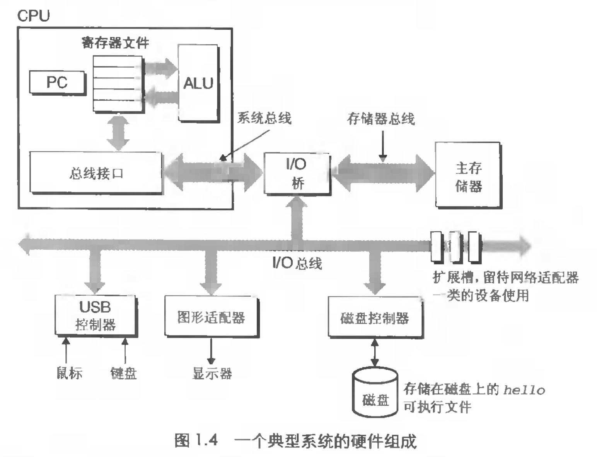

# 第一章_计算机系统漫游

计算机由硬件和软件组成，硬件是计算机的基础，软件是计算机的行为。

## 信息 = 位 + 上下文

位 / 比特 bit ：指的是计算机中的一个数字，每个数字都有一个二进制的表示。
字节 byte：由 8 个一组的位组成。每个字节都表示程序中某个文本字符。

系统中所有信息——包括磁盘文件、存储器中的程序、存储器中存放的用户数据和网络上传的数据，都是由一串比特来表示的。

区别不同数据对象的唯一方法：是读数据对象的上下文。
比如，完全相同的字节序列，在不同的上下文中，可能是整数、浮点数、字符串或是机器指令等。

> C 语言的成功之处：
> 1. C 与 Unix 系统关系紧密。C 是作为一种用于 Unix 系统程序的开发语言被开发出来的。Unix 内核的大部分，以及所有它支持的工具和函数库也都是 C 来编写的。C 也因此能方便地移植到新机器上。
> 2. C 是一个小而简单的语言。由一个人而不是一个协会设计，简单明了，没有冗赘的设计。因此更易学习与移植到其他计算机上。
> 3. C 是为实践目的设计的。C 本来是用来实现 Unix 操作系统的，但后来发现它也能很好地编写其他程序。

## 程序被其他程序翻译成了不同的格式

一段 C 程序源代码 hello.c 要经过四个阶段的处理，才能最终执行。

1. 预处理器 cpp
   
   - 得到另一个 C 程序，通常以 .i 作为文件拓展名。

2. 编译器 ccl
   
   - 将文本文件 hello.i 翻译成文本文件 hello.s。
   - 编译器包含一个汇编语言程序。   
   - 该程序中的每条语句都**以一种标准的文本格式**确切地描述了一条**低级机器语言指令**。
   
   > 汇编语言为不同的高级语言的不同的编译器提供了通用的输出语言。

3. 汇编器 as
   
   - 将 hello.s 翻译成机器语言指令，把这些指令打包成一种叫做**可重定位（relocatable）**目标程序的格式，并将结果保存在目标文件 hello.o 里面。
   - hello.o 是一个二进制文件，字节编码是机器语言指令，而不是字符。
   - 在文本编辑器中打开，将会看到一团乱码。
      
4. 链接器 ld
   
   - 如果我们用到另一个预编译目标文件中的函数等，我们就需要将这个文件以某种方式并入到我们目前的程序中来，链接器（ld）就负责这种并入。

经过这四步后，我们会得到一个可执行文件，可执行文件加载到存储器后，由系统负责执行。

> **GNU 项目**
> GNU（GNU's Not Unix）项目于 1984 年被发起的一个慈善项目。该项目的目标是，开发出一个完整的类 Unix 系统。
> 
> GNU 环境包括 **EMACS 编辑器**、**GCC 编译器**、**GDB 调试器**、汇编器、链接器、处理二进制文件的工具和其他一些部件。
> 
> GNU 项目取得了非凡的成绩，却常常被忽视。
> - 现代开放源码运动的思想起源是 GNU 项目中的 自由软件（free software）概念，而不是 Linux。
> 
> Linux 的知名度很大程度上要归功于 GNU 工具，因为是 GNU 工具为 Linux 内核提供了环境。
> 
> [GNU 操作系统 - 自由软件基金会](https://www.gnu.org/gnu/linux-and-gnu.zh-cn.html)

## 了解编译系统如何工作是大有益处的

程序员必须知道编译系统是如何工作的重要原因：

1. **优化程序性能**。
   其实现代编译器都已经是成熟的工具，作为程序员，无需去了解编译器内部工作也可以写出高效的代码。
   但是对汇编语言和编译器如何将高级语言转化为汇编语言有一个基本的了解，可以让我们更能理解一段逻辑的不同代码实现各自的优缺点。

2. **理解链接时出现的错误**。
   根据作者经验，一些最令人苦恼的问题往往都与链接器操作有关，尤其在大型项目中时。

3. **避免安全漏洞**。
   **缓冲区溢出错误**造成了大多数网络和 Internet 服务器上的安全漏洞。
   这些错误是因为太多程序员忽略了，编译器用来为函数产生代码的堆栈规则。

## 处理器读并解释存储在存储器中指令

处理器读取的是已经被编译系统转换成了的可执行目标文件。

这个可执行目标文件被放在磁盘上。

## 系统的硬件组成

为了了解一段程序运行的时候，都发生了什么，我们必须对硬件系统有一定的了解。

一个典型系统的硬件组成：

> 1. CPU：中央处理单元
> 2. **ALU**：算术/逻辑单元
> 3. **PC**：程序计数器
> 4. **USB**：通用串行总线

1. 总线。
   总线是贯穿整个系统的是一组电子管道。
   它携带信息字节，并负责在各个部件传递。
   通常，总线被设计为传送定长的字（word 字节块）。
   
   字中的定长是一个基本的系统参数，各个系统中不尽相同：
   * Inter Pentium 系统中字长为 4 字节；
   * 服务类系统里有些系统为 8 字节；
   * 用于汽车和工业中的嵌入式控制器之类比较小的系统的字长往往只有 1 / 2 字节；

2. I/O 设备
   I/O（输入/输出）设备是系统与外界的联系通道。
   
   上图的示例系统里包括了四个 I/O 设备：
   1. 用户输入的键盘和鼠标；
   2. 用户输出的显示器；
   3. 长期储存数据和程序的磁盘驱动器（磁盘）；
   
   每个 I/O 设备都是通过一个**控制器或适配器**与 I/O 总线连接起来的。

   > 控制器与适配器的区别主要在于他们的组成方式
   > 1. 控制器：I/O 设备里或是其系统的主印制电路板（主板）上的芯片组；
   > 2. 适配器是一块插在主板插槽上的卡。
   > 
   > 功能都是在 I/O 总线和 I/O 设备之间传递信息。

3. 主存（主存储器）
   主存是一个临时存储设备，在处理器执行程序时，被用来存放程序和程序处理的数据。
   
   物理上来说，主存就是由**一组 DRAM（动态随机存取存储器）芯片**组成的。
   逻辑上来说，存储器是由**一个线性的字节数组**组成的，每个字节都有自己唯一的地址（数组索引），地址从 0 开始。
   > 一般来说，组成程序的每条机器指令都由不定量的字节组成。
   > 比如，C 程序中不同种类的变量对应的数据项大小是不一样的。在运行 Linux 的 Inter 机器上，short 类型的数据只需要 2 字节，int、float 和 long 类型需要 4 字节，double 类型需要 8 字节。

4. 处理器
   CPU（中央处理器）简称处理器，

